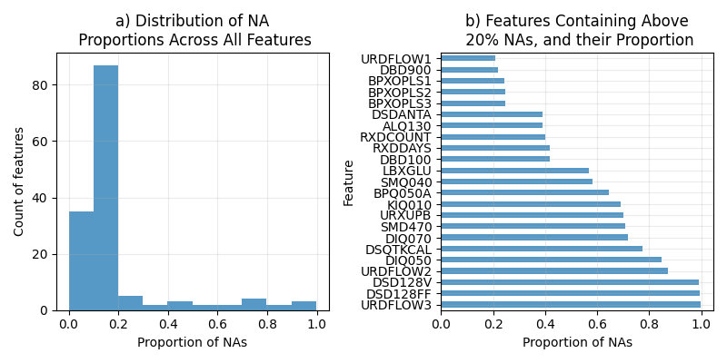
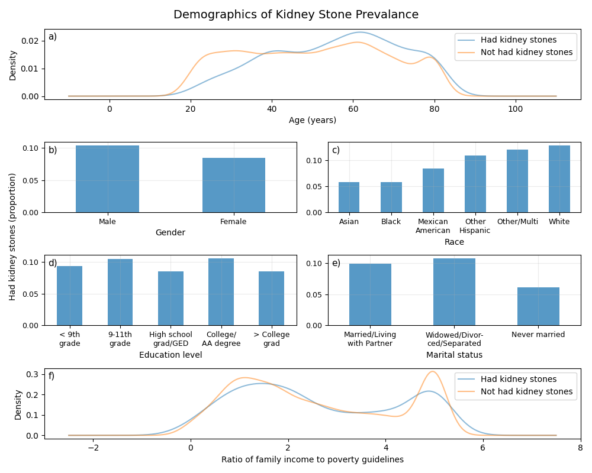
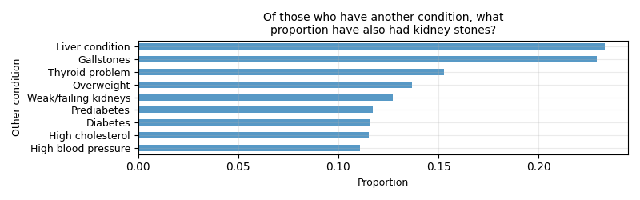
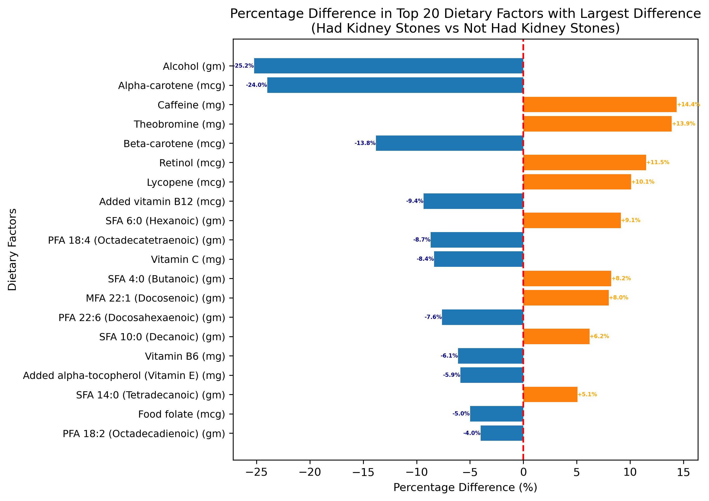
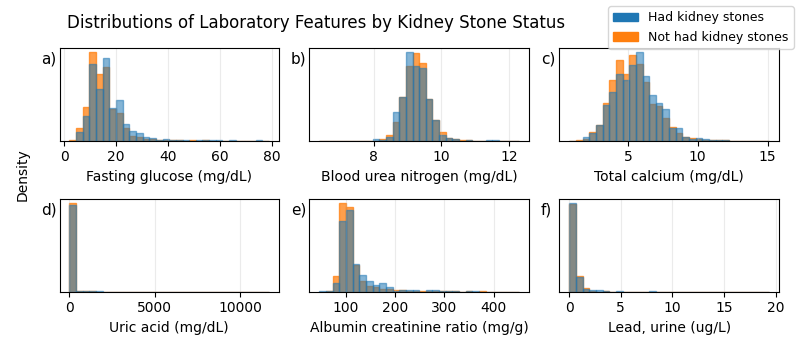
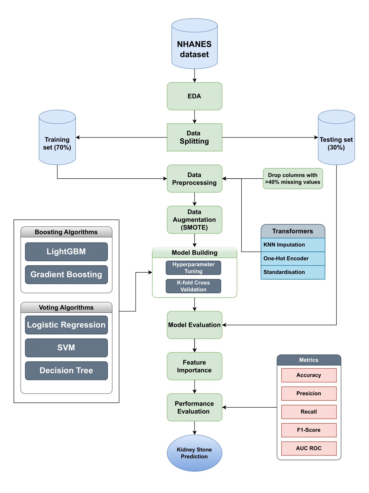

# Ensemble Learning Approaches For Predicting Occurrence of Kidney Stones in NHANES 2017 - 2020

**Author:** David Nguyen 300584723 (Individual)

[Individual Github Repository](https://github.com/dvnguyen02/KStoneClassifierML)

[Group 2 Github Repository](https://github.com/dvnguyen02/DATA301-Project.git)

**Team:** Katie Chu-Fong 300601174; Thinh Nguyen 300611544; Brook Thomson 300653729

## Executive Summary

Kidney stones affect approximately 10% of people in their lifetime, causing severe pain and potentially leading to serious complications. Our research aimed to develop a predictive model to identify individuals at high risk for kidney stone formation, using data from the National Health and Nutrition Examination Survey.

We analyzed various factors and found that several key elements are strongly associated with an increased risk of kidney stones:
- High blood pressure
- Gender (being female)
- Saturated fatty acid intake (particularly dodecanoic acid)
- Abdominal pain history
- Vitamin A intake
- Age
- Race (particularly non-Hispanic White and non-Hispanic Black)
- History of gallstones

Our predictive model demonstrated strong performance in identifying individuals at risk for kidney stones. Importantly, the model revealed that risk factors can vary significantly between individuals. For example, high blood pressure emerged as one of the most significant risk factors, while certain dietary elements like saturated fatty acid intake also played a crucial role.

These findings highlight the complex nature of kidney stone formation and underscore the importance of personalized risk assessment. By leveraging these insights, healthcare providers can implement targeted preventive measures, potentially reducing the incidence of kidney stones, improving patient outcomes, and decreasing healthcare costs associated with treatment and complications.

Additionally, we recommend implementing targeted screening programs and patient education focusing on modifiable risk factors. While our model is promising, further research is needed to fully understand kidney stone formation mechanisms and refine predictive models, particularly regarding the interplay between physiological conditions and dietary factors across diverse populations.

## Table of Contents
- [Ensemble Learning Approaches For Predicting Occurrence of Kidney Stones in NHANES 2017 - 2020](#ensemble-learning-approaches-for-predicting-occurrence-of-kidney-stones-in-nhanes-2017---2020)
  - [Executive Summary](#executive-summary)
  - [Table of Contents](#table-of-contents)
  - [1. Background](#1-background)
  - [2. Data Description](#2-data-description)
    - [2.1 Data Structures and Types](#21-data-structures-and-types)
    - [2.2 Summary of the Data](#22-summary-of-the-data)
  - [3. Ethics, Privacy, and Security](#3-ethics-privacy-and-security)
    - [3.1 Ethical Considerations](#31-ethical-considerations)
    - [3.2 Privacy Concerns](#32-privacy-concerns)
    - [3.3 Security Measures](#33-security-measures)
  - [4. Exploratory Data Analysis](#4-exploratory-data-analysis)
    - [4.1 Demographic Analysis](#41-demographic-analysis)
    - [4.2 Health Conditions Analysis](#42-health-conditions-analysis)
    - [4.3 Dietary Analysis](#43-dietary-analysis)
    - [4.4 Laboratory Analysis](#44-laboratory-analysis)
  - [5. Detailed Analysis Results](#5-detailed-analysis-results)
    - [5.1 Modelling Methodology Overview](#51-modelling-methodology-overview)
    - [5.2 Data Preprocessing and Data Augmentation](#52-data-preprocessing-and-data-augmentation)
      - [5.2.1 Data Preprocessing Techniques](#521-data-preprocessing-techniques)
      - [5.2.2 Data Augmentation](#522-data-augmentation)
    - [5.3 Model Development](#53-model-development)
    - [5.4 Interpretation of Model Results](#54-interpretation-of-model-results)
    - [5.5 Estimates Of Risk Behind The Models](#55-estimates-of-risk-behind-the-models)
  - [6. Conclusions, Recommendation and Limitations](#6-conclusions-recommendation-and-limitations)
    - [6.1 Conclusions](#61-conclusions)
    - [6.2 Recommendations](#62-recommendations)
    - [6.3 Limitations](#63-limitations)
  - [7. References](#7-references)

## 1. Background

Is kidney stone prevalence associated with factors such as diet, lifestyle, and other existing medical conditions? Kidney stones are solid deposits of minerals and salts that develop in the urinary tract, and can cause blockage and severe pain when urine is passed (National Institutes of Health, n.d.). It is a common condition that affects approximately 10% of people at least once in their lifetime, and in some cases may require significant and/or recurrent treatment (Abufaraj et al., 2020). 

This report presents an exploratory data analysis, investigating variables previously shown to be associated with kidney stone occurrence. It is based on the [National Health and Nutrition Examination Survey](https://www.cdc.gov/nchs/nhanes/index.htm) (NHANES) from the [National Center for Health Statistics](https://www.cdc.gov/nchs/index.htm), of the [Centers for Disease Control and Prevention](https://www.cdc.gov/). NHANES is an ongoing program of surveys in the United States that assesses the health and nutritional status of adults and children. The surveys collect health-related data ranging over a number of topics, which are organised broadly into Demographics, Dietary, Examination, Laboratory, and Questionnaire. It is widely used to analyse or identify associative or causal factors of various conditions and/or diseases, such as diabetes, hypertension, and hearing loss. Thus, the comprehensive scope of NHANES makes it an ideal resource to investigate factors associated with kidney stones, especially given the diverse range of known causes.

In the following sections, we evaluate the completeness, quality, and distributions of kidney stone-relevant data in NHANES. Data from the most recent cycle is used, [NHANES 2017 - March 2020](https://wwwn.cdc.gov/nchs/nhanes/continuousnhanes/default.aspx?Cycle=2017-2020).

## 2. Data Description
### 2.1 Data Structures and Types

Data from each NHANES cycle is released as many tables, each containing a collection of similar features. For the specific focus on kidney stone disease, only a subset of tables is used, and from these tables, only a subset of key features. The integrated dataset used in this project is composed of 9,208 instances/rows, and 146 columns. The column `SEQN` contains a unique identifier for each instance, and the column `KIQ026` contains the target variable. Thus, there are 144 informative features. 

The target variable belongs to the Questionnaire component of NHANES, and is phrased as "Ever had kidney stones?". Possible answers of this question are "Yes", "No", "Refused", and "Don't know". Only Yes/No are used as the binary classification label of this project.

Counts (and proportions) of the binary target variable classes are as follows:

* Yes, has had kidney stones: 866 instances (9.4%)
* No, has not had kidney stones: 8342 instances (90.6%)

The key features are broadly described in the following:

* **Demographic**: gender, age, race, education, marital status, and income. 
* **Dietary**: vitamin, water, nutrient, and dietary supplement intake. Everyday foods in the NHANES dietary interviews are deconstructed and aggregated into their nutritional components.
* **Examination**: body mass index (BMI), blood pressure, and pulse readings.
* **Laboratory**: aspects of biochemistry profile, and urine-associated tests.
* **Questionnaire**: past medical history (conditions and medicines), dietary and alcohol habits, urinary tract function, physical activity, smoking, and sleep habits.

Feature type ranges from numerical continuous and discrete to categorical binary, nominal, and ordinal. Dietary, examination, and laboratory data are mainly numerical, while demographic and questionnaire data are mainly categorical. To avoid difficult or complicated natural language processing or text mining, free-text data was not selected.

Counts of feature types and brief examples are as follows:

* **97 numerical features**, e.g. energy in kilocalories (continuous); age in years (discrete)
* **49 categorical features**, e.g. gender (binary: male, female); race (nominal: Mexican American, other Hispanic, white, etc.)

### 2.2 Summary of the Data

97 features have no missing values (not including the unique identifier and target variable columns). 

Features that do have missing data can be summarised as follows:

* 15 features have under 25% missing data
* 5 features have 25 - 50% missing data
* 13 features have 50 - 75% missing data
* 14 features have 75% - 100% missing data

Overall, the majority of features do not contain a substantial proportion of missing data (Figure 1a).

Over half of features have less than 20% missing data (Figure 1a). Features from the table "Dietary Interview - Total Nutrient Intakes" ([P_DR1TOT](https://wwwn.cdc.gov/Nchs/Nhanes/2017-2018/P_DR1TOT.htm)) are the main contributors to this particular proportion. A large number of features were selected from that table, and data collected within pertains to a consistent subset of people.

## 3. Ethics, Privacy, and Security

### 3.1 Ethical Considerations

* **Epistemic** – evidence related ethical issues. This includes bias within a dataset, opacity in decision making, and inaccurate decisions made from inconclusive evidence. 

* **Normative** – learning and transforming processes of algorithms which may result in discriminatory outcomes and/or outcomes where the reasoning is unclear and therefore difficult for a patient to understand, or refute. 

* **Traceability** – the ability to trace mistakes, and identify responsibility for mistakes. Additionally, that information about the algorithm be accessible and comprehensible (Mittelstadt et al., 2016) 

Ethical issues in healthcare machine learning fall into three categories: epistemic (evidence-related), normative (fairness and transparency), and traceability (accountability and comprehensibility). These are interrelated; for instance, dataset bias (epistemic) can lead to discriminatory outcomes (normative). In kidney stone prediction, while not immediately life-threatening, accuracy remains crucial for informed consent and appropriate preventative measures. The algorithm should be traceable, with efforts made to reduce dataset bias and ensure clear reasoning behind risk assessments.

### 3.2 Privacy Concerns

Personal health data privacy is a major concern, governed by extensive legislation. As we're using NHANES data from a U.S. government agency, we must consider U.S., local, and international laws, as well as social norms. Our moral duty extends beyond data collection to its use.
Four U.S. federal laws apply to NHANES data privacy:

1. The Privacy Act of 1974
2. The Confidential Information Protection and Statistical Efficiency Act
3. The Cybersecurity Enhancement Act
4. Section 308(d) of the Public Health Service Act

These laws ensure individual consent, data use restrictions, non-identifiability, and cybersecurity measures. NHANES complies with these acts, and our statistical use aligns with requirements.
U.S. states have varying data privacy laws, which are evolving. While NHANES collects geographic information, its use is restricted. The public NHANES data contains no identifiable information, with special permissions required for accessing certain identifiers, ensuring patient confidentiality.

### 3.3 Security Measures

To comply with NCHS requirements, we've implemented security measures for the NHANES dataset. Data is stored in access-controlled repositories with separate directories for raw and processed data. Access is restricted to authorized team members based on specific tasks. We use encrypted data transfers, maintain audit trails, and employ version control. Two-factor authentication and regular access reviews are enforced. Only essential project-related data is stored and processed. Upon project completion, all data will be securely deleted from all storage locations, ensuring NCHS compliance throughout the project lifecycle.

## 4. Exploratory Data Analysis

### 4.1 Demographic Analysis

Age demonstrates a significant correlation with kidney stone occurrence. The prevalence increases steadily from ages 20-40, plateaus briefly, then peaks around age 60. Notably, individuals over 50 show a higher likelihood of having experienced kidney stones compared to younger cohorts. Gender plays a significant role in kidney stone prevalence, with males showing a slightly higher rate (10%) compared to females (8%). We have also noticed Racial Disparities in kidney stone prevalence are evident. Asian and Black populations exhibit the lowest rates (just above 5%), while White and other/multiracial groups show the highest (close to 15%). 

Education level appears to have minimal impact on kidney stone prevalence. The difference between the highest prevalence (college/AA degree at ~10%) and lowest (high school grad/GED at ~8%) is relatively small. The ratio of family income to poverty guidelines suggests an inverse relationship with kidney stone prevalence. Higher ratios (>4), indicating income well above poverty thresholds, correspond with lower kidney stone occurrence.

Age, gender, and income-to-poverty ratio all show associations with kidney stone prevalence. While education level appears less influential, it may still provide contextual information. These demographic factors could prove valuable in predictive models for kidney stone risk.

### 4.2 Health Conditions Analysis

Gallstones and weak/failing kidneys show the strongest association with kidney stone occurrence, with about 25% of individuals having these conditions also experiencing kidney stones. Other health conditions exhibit a 11-15% co-occurrence rate with kidney stones, all exceeding the overall prevalence of 9.4%. These elevated rates suggest these features could be valuable for predictive modeling. 

### 4.3 Dietary Analysis

Alpha-carotene and beta-carotene (both forms of vitamin A) display substantial negative differences (-24.0% and -13.8% respectively), with those who have had kidney stones consuming less. In contrast, other form of vitamin A, Retinol intake is 11.5% higher in the kidney stone group, contrasting with the carotenoid findings. Some research has indicated that excessive vitamin A intake may increase kidney stone risk (Tang et al., 2012), which could explain the lower carotenoid but higher retinol intake in those with a history of stones. Caffeine and theobromine consumption is notably higher in those with a history of kidney stones (14.4% and 13.9% more, respectively). While caffeine has been associated with increased risk of kidney stones in some studies (Ferraro et al., 2014), the higher intake in those with a history of stones could reflect changes in fluid consumption patterns post-diagnosis.

Vitamin C intake is 8.4% lower in individuals who have had kidney stones. This aligns with studies suggesting that high-dose vitamin C supplementation may increase kidney stone risk (Thomas et al., 2013), potentially leading to reduced intake in those with a history of stones. Among the top factors, we see a trend in vitamins and antioxidants, particularly forms of vitamin A, vitamin C, and vitamin E (alpha-tocopherol).

### 4.4 Laboratory Analysis

Figure 4 shows that most laboratory features appear within expected ranges, with the exception of uric acid (Figure 4d). There appears to be outlier(s) skewing this feature with up to 10000 mg/dL uric acid, which is likely to be an error as ordinary uric acid levels should not exceed the single-digit mg/dL range. 

Distribution shape of laboratory features remains relatively identical, regardless of kidney stone status. Distributions for fasting glucose (Figure 4a) and total calcium (Figure 4c) are shifted slightly right (towards higher values) for those who have had kidney stones. The peak bin for blood urea nitrogen (Figure 4b) is at a marginally lower value for those who have had kidney stones in comparison to those who have not. Albumin creatinine ratio appears to peak later, and remain slightly higher, at increasing mg/g for those who have had kidney stones (Figure 4e). Distributions for lead (Figure 4f) and uric acid are consistent for both kidney stone statuses - however, detail in the uric acid histogram may be obscured by the outlier(s). Therefore this indicates that uric acid and lead are not associated with kidney stone prevalence. 

## 5. Detailed Analysis Results
### 5.1 Modelling Methodology Overview

### 5.2 Data Preprocessing and Data Augmentation

#### 5.2.1 Data Preprocessing Techniques

Our data preprocessing pipeline involved several key steps to prepare the dataset for model training. We began by splitting the dataset into training and testing sets using a 70-30 ratio, ensuring sufficient data for both model training and unbiased evaluation. Feature selection was performed by removing features with more than 40% missing values, reducing the number of features from 145 to 128. For the remaining features, we employed K-Nearest Neighbors (KNN) imputation with k=5 neighbors to handle missing values, potentially preserving important data relationships. Numeric features were then standardized using Standard Scaler to have zero mean and unit variance, while categorical variables were encoded using one-hot encoding with the 'ignore' option for handling unknown categories during model inference. These steps collectively focused our analysis on the most complete and potentially informative variables while preparing the data for effective model training.

#### 5.2.2 Data Augmentation

In our initial training set, we observed a significant class imbalance, with 6,445 total records comprising 5,818 patients without kidney stones (90.3%) and only 627 patients with kidney stones (9.7%). This imbalance posed a potential challenge, as models could be biased towards the majority class, potentially leading to poor predictive performance for the minority class.

To mitigate this issue, we employed the **Synthetic Minority Over-sampling Technique (SMOTE)**. SMOTE works by creating synthetic examples of the minority class, effectively increasing its representation in the dataset without simply duplicating existing instances. Post-SMOTE, our training set achieved balance with 5,818 records in each class, resulting in a total of 11,636 records. With equal representation of both classes, our models can learn patterns associated with kidney stone presence more effectively.

For a visual representation of the data distribution before and after SMOTE balancing, please refer to Appendix C.

### 5.3 Model Development

We chose these models for their complementary strengths:

Gradient Boosting is known for effective handling of complex interactions and non-linear relationships in medical data. LightGBM is chosen for its efficiency with large datasets and ability to handle categorical features directly. Voting Classifier, an ensemble model that combines Logistic Regression, Decision Tree, and Support Vector Machine (SVM) classifiers. This approach leverages the strengths of different algorithms to make predictions.

| Model | Accuracy | Precision | Recall | F1 Score | ROC AUC |
|-------|----------|-----------|--------|----------|---------|
| Gradient Boosting | 0.864 | 0.4144 | 0.1633 | 0.2331 | 0.5858 |
| LightGBM | 0.8743 | 0.4677 | 0.2059 | 0.2857 | 0.6313 |
| Voting Classifier | 0.8633 | 0.4108 | 0.165 | 0.2348 | 0.5866 |

*Table 1: Performance Comparison Between Classifiers.*

The performance metrics of our three classifiers - Gradient Boosting, LightGBM, and Voting Classifier - are presented in Table 1, with detailed confusion matrices available in Appendix A. All models exhibit high accuracy (>0.86), suggesting strong predictive capability for kidney stone occurrence. However, given the imbalanced nature of our dataset, accuracy alone is insufficient for comprehensive evaluation. The ROC AUC scores, ranging from 0.5858 to 0.6313, are lower than expected, indicating potential difficulties in distinguishing more nuanced cases despite good overall classification. LightGBM marginally outperforms the other models across most metrics, suggesting its effectiveness in capturing underlying patterns in our dataset. Gradient Boosting shows comparable performance, with only slight differences in ROC AUC. These results highlight the models' strengths in general classification while also revealing areas for potential improvement in handling more challenging instances.

### 5.4 Interpretation of Model Results 

The beeswarm plot illustrates SHAP values for each feature, showing their impact on model predictions. Gallstones and age generally increase kidney stone likelihood, with age showing a positive correlation. Non-Hispanic Black ethnicity indicates reduced risk, while Non-Hispanic White suggests increased risk.
Dietary factors show varied impacts: short-chain saturated fatty acids and vitamin A have wide-ranging effects, while very long-chain polyunsaturated fatty acids suggest a potential protective effect. Abdominal pain is a significant predictor, and the albumin creatinine ratio shows variable impact across patients.

To understand how these factors interact in individual cases, we'll examine a specific instance demonstrating the complex interplay between different risk factors.

In this case, the model's final prediction f(x) is 0.30, which is greater than the base value. This positive difference indicates that for this specific patient, the combined effect of the variables increases the predicted risk above the average model output.

The plot highlights two key variables, MCQ550 (history of gallstones) shows a substantial negative impact of -1.9567, suggesting that for this individual, a history of gallstones significantly lowers the predicted risk of kidney stones. On the other hands, DR1TLZ (Lutein + Zeaxanthin intake in mcg) demonstrates a positive influence of 1.1256, partially offsetting the negative effect of gallstones.

The interplay between these factors results in a net positive effect, pushing the final prediction above the base value. This example illustrates how factors that may have a general trend in the population (such as gallstones typically increasing risk) can have different effects in individual cases, and how dietary factors like Lutein and Zeaxanthin intake can modulate the overall risk.

### 5.5 Estimates Of Risk Behind The Models

The NHANES dataset, while comprehensive, may not be fully representative of all demographics. Certain populations might be under-represented, potentially skewing our predictions (i.e Non-Hispanic in SHAP feature importance). In addition, some predictors, particularly dietary intake measures, rely on self-reporting, which can be subject to recall bias. The dataset is also cross-sectional, capturing a snapshot in time. This limits our ability to infer causal relationships or account for how risk factors might change over time.

While we've used ensemble methods to reduce potential bias, our models may still have inherent biases. For example, the high accuracy but lower ROC AUC scores suggest our models might be overfitting to certain patterns in the majority class. In addition, SMOTE helped address class imbalance, it generates synthetic examples but may not represent real-world data distributions.

## 6. Conclusions, Recommendation and Limitations
### 6.1 Conclusions
Our kidney stone prediction model successfully identified several key factors associated with increased risk of kidney stone formation. These include age, race (particularly Non-Hispanic White), presence of certain health conditions (high blood pressure, gallstones), body mass index, and specific biochemical markers (albumin-creatinine ratio).

Dietary factors, including intake of certain fatty acids (e.g., SFA 6:0 Hexanoic) and vitamins (particularly Vitamin A), play a complex role in kidney stone risk, with their effects not always being straightforward.

### 6.2 Recommendations
Patient at risks should be more educated about the importance of modifiable risk factors, particularly hydration and dietary choices. The protective effect of adequate fluid intake should be a key message. Healthcare systems should also consider implementing screening programs for kidney stone risk, especially for individuals with identified high-risk factors such as high blood pressure or gallstone.

### 6.3 Limitations
The model is based on cross-sectional data from the NHANES survey, which limits our ability to establish track risk factors over time. While our model incorporates a wide range of factors, it may not capture all possible influences on kidney stone formation, such as genetic predisposition or certain environmental factors. The model's performance may vary across different populations not well-represented in the NHANES dataset.

## 7. References

Please refer to the original report located in results/project.pdf